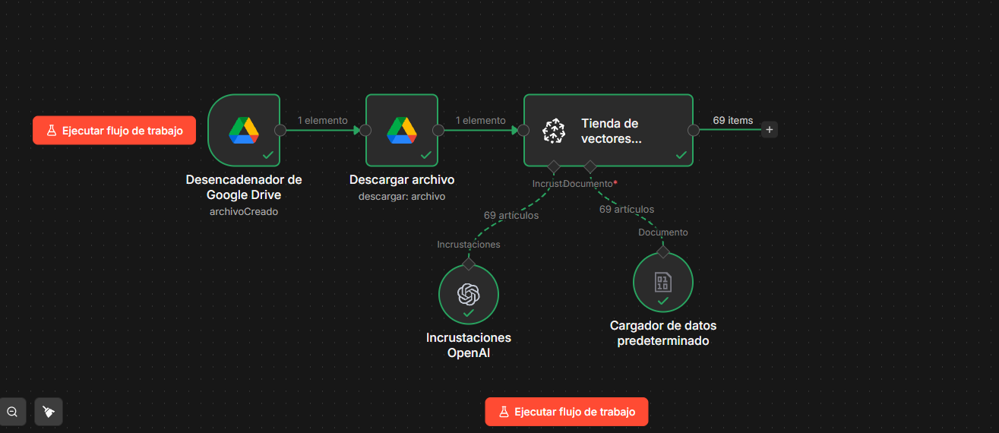
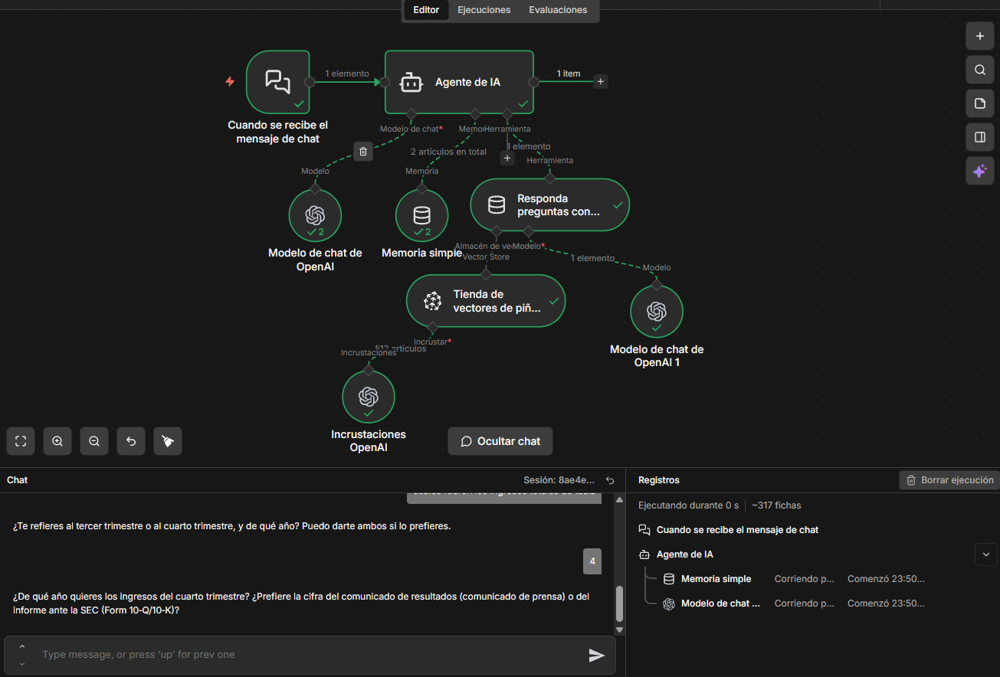

# 🤖 Flujo de Trabajo para Agentes de IA con Modelos de Lenguaje y Bases de Datos Vectoriales

Este repositorio/documentación describe un flujo de trabajo para construir agentes de inteligencia artificial que integran modelos de lenguaje (LLMs) con bases de datos vectoriales para responder preguntas y automatizar tareas.

---

## 📋 Descripción General

- Recepción y procesamiento de mensajes de chat.
- Uso de modelos de chat de OpenAI para interpretar y generar respuestas.
- Almacenamiento y recuperación de contexto mediante memoria simple.
- Consulta de bases de datos vectoriales para respuestas basadas en documentos relevantes.
- Uso de incrustaciones (embeddings) de OpenAI para indexar y buscar información.

---

## ⚙️ Componentes Clave

- **Agente de IA:** Núcleo que recibe mensajes y coordina respuestas.
- **Modelo de Chat OpenAI:** Motor de generación de lenguaje natural.
- **Memoria Simple:** Guarda contexto de la conversación para mantener coherencia.
- **Tienda de Vectores:** Base de datos que almacena documentos en formato vectorial para búsqueda eficiente.
- **Incrustaciones OpenAI:** Técnica para convertir texto en vectores numéricos.

---

## 🎯 Objetivos

- Proveer respuestas precisas y rápidas basadas en documentos financieros o cualquier base de datos relevante.
- Mantener claridad sobre la fuente de la información (por ejemplo, trimestre específico de un reporte).
- Evitar información no verificada o fuera del alcance de los documentos disponibles.

---

## 📈 Aplicaciones

- Análisis financiero automatizado (ejemplo: reportes trimestrales de Tesla).
- Soporte en atención al cliente con acceso a bases de conocimiento.
- Automatización de respuestas en chatbots con contexto actualizado.

---

## 🤝 Contribuciones

Este proyecto está abierto a mejoras y colaboraciones. Si deseas aportar, abre un issue o pull request con tus sugerencias o implementaciones.

---

## 📚 Referencias

- OpenAI API
- Bases de datos vectoriales (Pinecone, Weaviate, Chroma)
- Modelos de lenguaje y agentes conversacionales
- Técnicas de embeddings y recuperación de información

---

Este README está diseñado para ser claro, conciso y útil para desarrolladores que trabajan con agentes de IA integrados con bases de datos vectoriales y modelos de lenguaje.