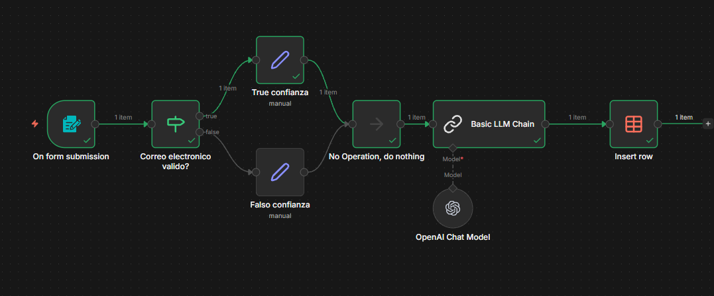

# 🚀 Automate Everything: n8n, LLMs, OpenAI API, Claude, Ollama, MCP & RAG

Este repositorio reúne mis trabajos, experimentos y proyectos sobre **automatización con agentes de IA y modelos de lenguaje (LLMs)**.  
Más que solo ChatGPT: aquí encontrarás integraciones con **Claude, Gemini, Deepseek, Llama, Mistral, Ollama, MCP** y otros, aplicados en flujos de trabajo reales con **n8n, APIs, RAG, y agentes privados/de negocio**.

---

## 📚 Contenido

### Fundamentos
- Conceptos clave de automatización, agentes de IA y LLMs
- APIs y función-calling para calendarios, emails, webhooks, Google Sheets, Airtable, etc.
- Principios de *prompt engineering* y buenas prácticas

### Herramientas y Frameworks
- **n8n**: instalación, nodos básicos, sub-workflows, debugging
- **Flowise, LangChain, LangGraph**: agentes y chatbots RAG
- Integración con **OpenAI API**, **Claude API**, **Deepseek API**, **Groq API**, entre otros
- Uso de **vector databases** y embeddings para RAG

### Aplicaciones
- Automatización de emails, resúmenes y respuestas inteligentes
- Chatbots RAG para generación de leads y sitios web
- Integración con WhatsApp, Telegram y redes sociales
- Web scraping y automatización avanzada con sub-workflows
- Agentes privados y de negocio: desde productividad personal hasta soluciones comerciales

### Hosting & Deployment
- Self-hosting de n8n con Render y otras opciones
- Extensión de n8n con JavaScript y herramientas personalizadas
- Estrategias de despliegue y comercialización de soluciones de automatización

---

## 💡 Objetivos del Repositorio
- Documentar paso a paso mis proyectos y aprendizajes
- Proveer ejemplos prácticos y workflows reutilizables
- Explorar el potencial de los agentes de IA más allá del uso básico de ChatGPT
- Mostrar cómo convertir la automatización en soluciones de negocio reales

---

## 🛠️ Tecnologías Clave
- **n8n, Make, Zapier**
- **OpenAI API, Claude, Ollama, MCP**
- **LangChain, LangGraph, Flowise**
- **Vector Databases (Pinecone, Weaviate, Chroma)**
- **Google Cloud, Airtable, Google Sheets**

---

## 📈 Visión
Este repositorio busca ser un **hub de conocimiento práctico** sobre automatización con IA, combinando:
- **Agentes privados** para productividad personal
- **Agentes de negocio** para marketing, ventas y soporte
- **Integraciones técnicas** con APIs y bases de datos
- **Estrategias de mercado** para vender soluciones de automatización

---

## 🤝 Contribuciones
Este es un proyecto en evolución y practica actualmente.  
Si quieres colaborar, proponer mejoras o compartir ideas, ¡bienvenido! Abre un issue o un pull request.

---
